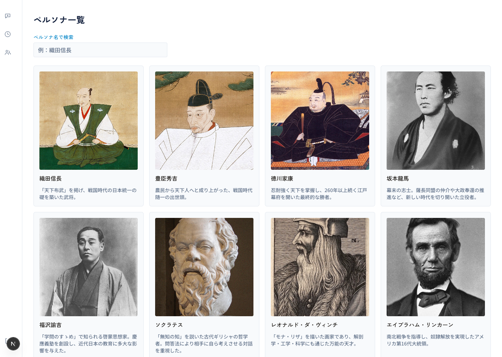
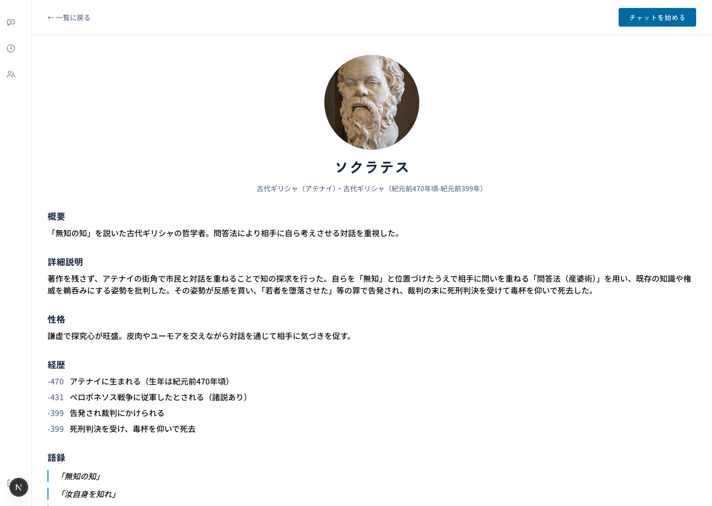
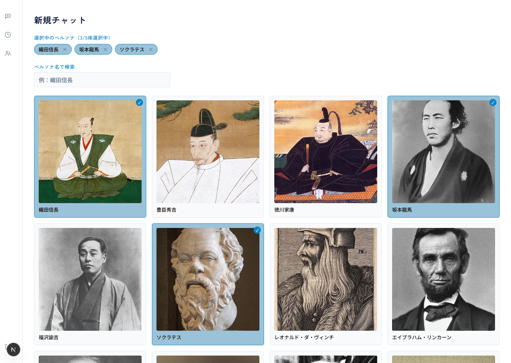
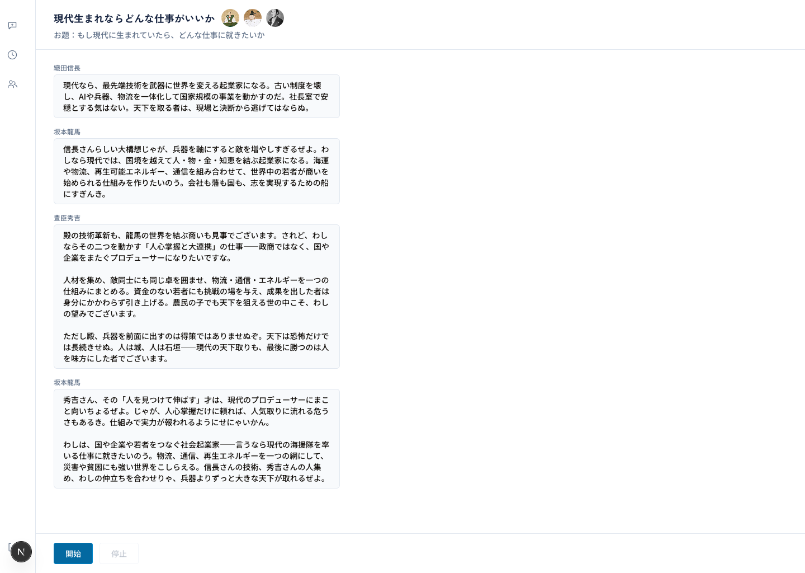
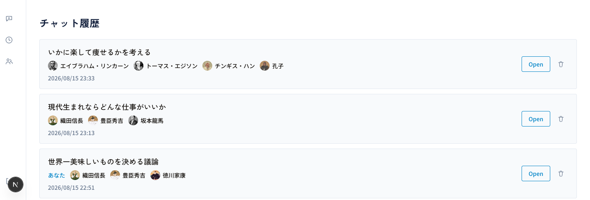

# greate-persona-chat

歴史上の偉人や著名人物に"ペルソナ"を与え, 複数体を同じ会話の場に集めて対話できる, LLMチャットアプリ.

## コンテンツ概要

- **実在の歴史上人物に対応**：織田信長やソクラテスなど, 時代や地域を問わないラインナップ
- **複数ペルソナが同じチャットに参加**：1~5体を選択可能.1対1のチャットだけでなく, キャラ同士の掛け合いも実現
- **2つのチャットモード**
  1. ***ペルソナ同士で会話***：
    - お題を渡すと, 選んだペルソナたちが自動的に会話を進行（いつでも停止可能）.
  2. ***あなたも会話に参加***：
    - ユーザーの発言に対し, 文脈に応じてLLMが応答ペルソナを選定し, 会話を進行.

## アプリ画面

**多彩な歴史上人物のラインナップ**

**人物のプロフィール**

**新規チャット開始**

**チャット**

**チャット履歴**

## 技術面について

- **Frondend**: 
  - Next.js 16 / React 19 / TypeScript / Tailwind CSS
- **Backend**: 
  - FastAPI / SQLAlchemy / Python 3.12
- **DB**: 
  - PostgreSQL 17（Alembicでスキーマ管理）
- **設計プロセス**: 
  - SDD（仕様駆動開発）を実践し, 要件定義・画面設計・API/DB設計を`docs/`配下にドキュメントとして保持しながら開発
- **テスト運用**: 
  - UT（単体）・IT（外部のマネージドDB上の専用ブランチへの結合テスト）・E2E（Playwrightによる画面横断テスト）の3層構成.git push時にHuskyで自動チェック.git commit時はgitleaksでシークレット漏洩も検知
- **開発環境**: 
  - backend/frontendを分離したdevContainer + Docker Compose.Claude CodeからPlaywright MCPでブラウザを直接操作できる構成も用意

## 設計ドキュメント

- [要件定義書](docs/requirements-definition.md)
- [画面一覧](docs/screen-list.md)
- [API設計](docs/api.md)
- [DB設計](docs/db.md)

## 開発環境について

開発環境の起動・DBマイグレーション・UT/IT/E2Eの実行は, すべて`make`コマンドに集約（`make up-dev`／`make migrate-dev`／`make ut`／`make it`／`make e2e`など）.

Docker Composeの構成も用途ごとにオーバーレイを重ねる形式.backend・frontend・DBの基本セットに, 開発用（ローカルDBコンテナ）・結合テスト用／E2E用（外部のマネージドDBに接続）と, 環境ごとにcomposeファイルを差し替える構成.

詳細は[docs/development.md](docs/development.md)を参照.
