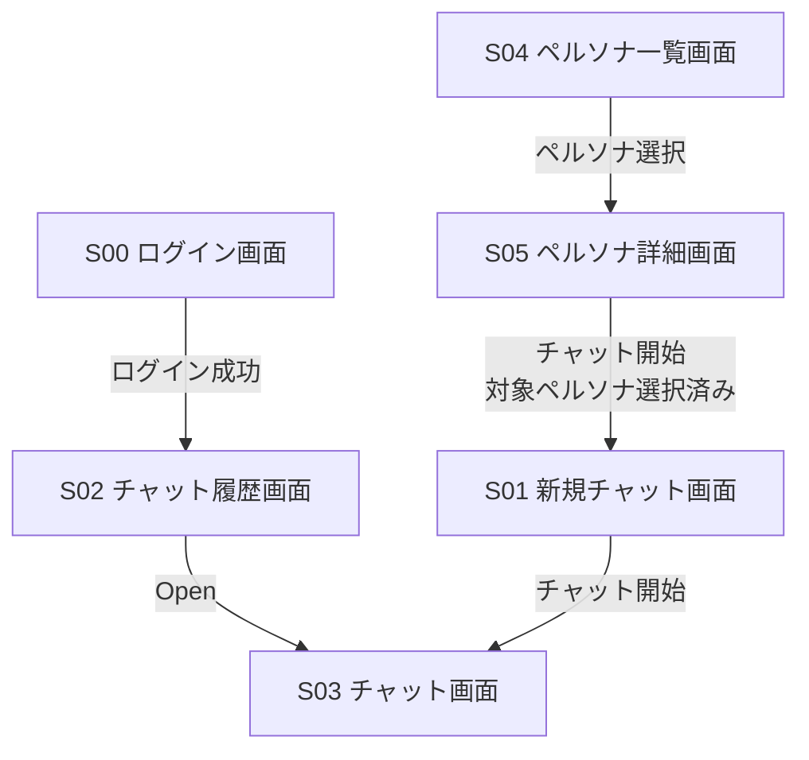
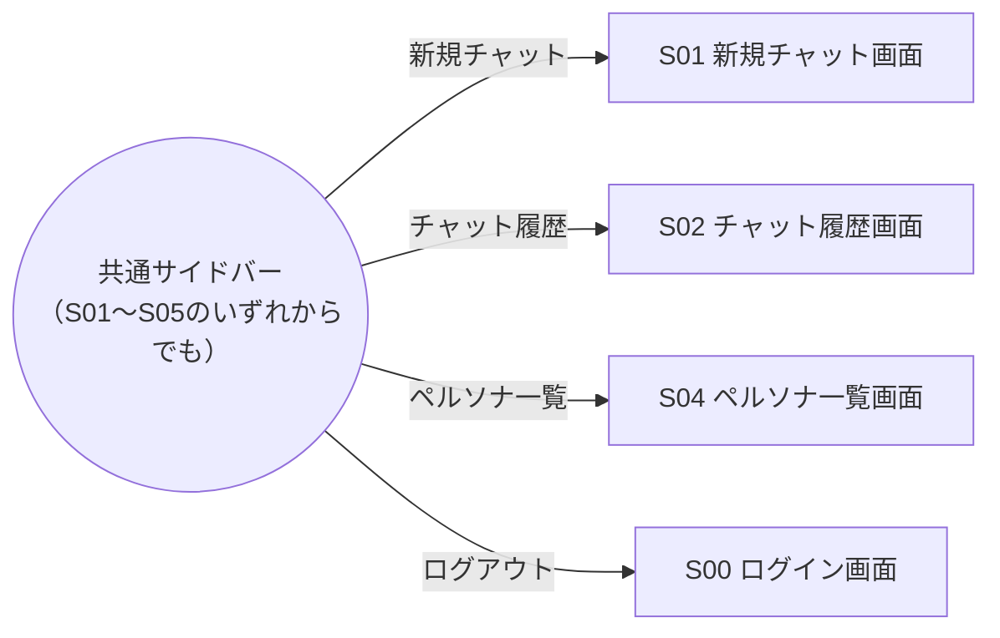
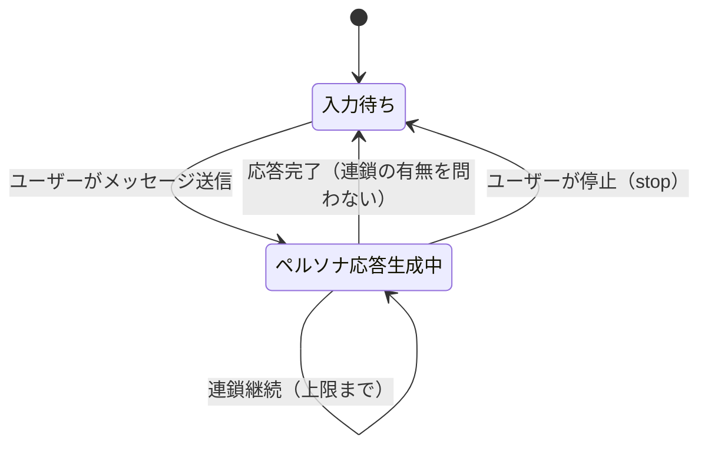
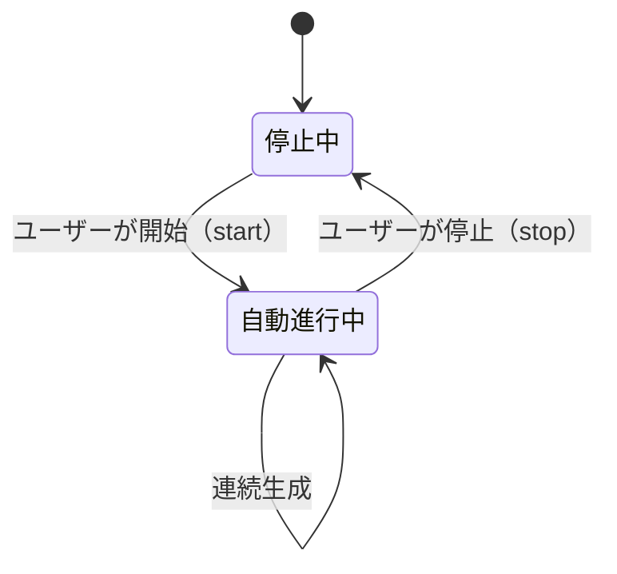

# 画面遷移図

対応する画面一覧は [screen-list.md](./screen-list.md) を参照。

## 1. 主要フロー

ログイン後の主要な画面遷移（業務フロー）を示す。共通サイドバーからの遷移は「2. 共通サイドバー遷移」に別途示す。

## 2. 共通サイドバー遷移

S01〜S05 のログイン後の全画面には共通サイドバーが表示され、以下の4項目へいつでも遷移できる。

## 3. チャット画面（S03）内の状態遷移

チャット画面はページ遷移ではなく、画面内の状態（生成中／待機中）で振る舞いが変わる。会話進行モデルの詳細は [api.md](./api.md) の「メッセージ送信（会話進行トリガー）」を参照。

`chat_mode` はチャット作成時に固定され、以後変わらないため、`USER_PARTICIPATED` と `PERSONA_ONLY` は状態遷移としても別物である。混在させず、モードごとに図を分ける。

### 3.1 USER_PARTICIPATED モード

「入力待ち」＝ユーザーが自由にメッセージを送信できる状態（送信ボタン有効）。

### 3.2 PERSONA_ONLY モード

「停止中」＝未開始または自動進行が止まっている状態（開始ボタンが表示されている）。

